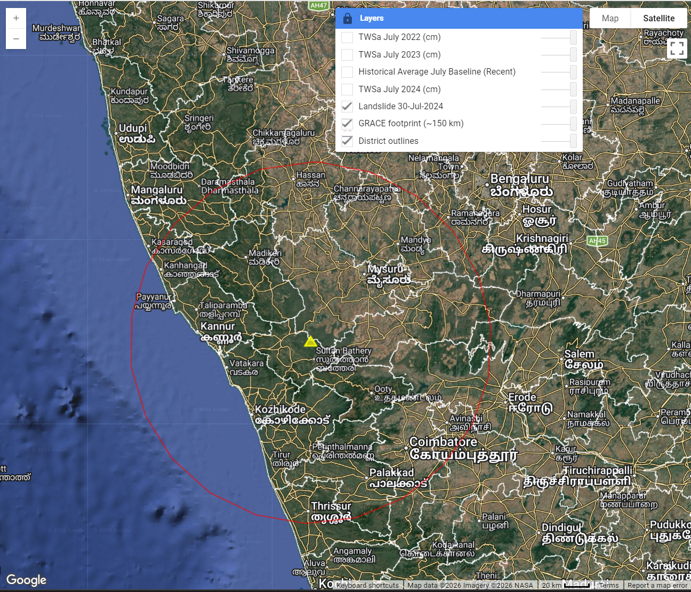
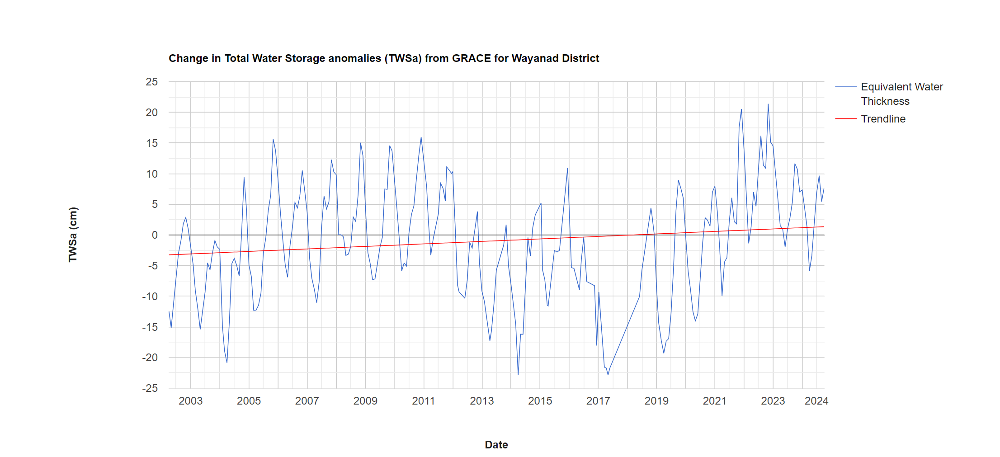
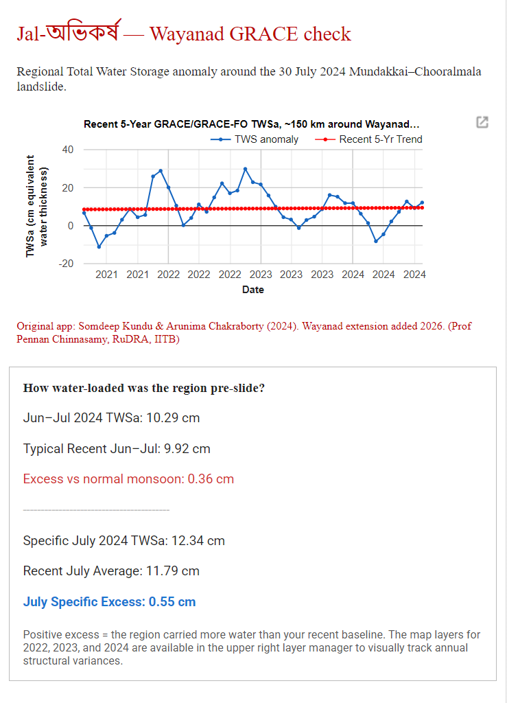

# Jal-অভিকর্ষ: Gravimetric Dynamics and Regional Water Storage Anomalies Surrounding the 2024 Wayanad Landslide

**Authors:** Somdeep Kundu & Pennan Chinnasamy  
**Affiliation:** Rural Data Research and Analysis (RuDRA) Lab, Centre for Technology Alternatives for Rural Areas (C-TARA), Indian Institute of Technology Bombay (IIT B)  

---

## 1. Introduction
The catastrophic landslides at Mundakkai and Chooralmala in the Wayanad district of Kerala on July 30, 2024, resulted in devastating loss of life and infrastructure. While the immediate trigger was extreme precipitation, slope failures of this magnitude are fundamentally governed by the antecedent moisture conditions and the total water load held within the subsurface geology. 

Traditional proxy-based modeling often relies on surface-level optical and radar sensors, which cannot directly quantify deep aquifer saturation. This report, developed under the *Jal-অভিকর্ষ* initiative, pivots toward a highly field-operationalizable, site-specific hydrological approach. By leveraging satellite gravimetry via the NASA GRACE-FO mission to measure the Total Water Storage anomaly (TWSa), this methodology observes micro-variations in the Earth's gravitational pull over the Western Ghats to quantify the anomalous regional water load leading up to the mass wasting event.

## 2. Methodology & Spatial Framework
To capture the localized gravimetric footprint of the event, a custom Google Earth Engine (GEE) architecture was deployed. 

* **Dataset:** NASA/GRACE/MASS_GRIDS_V04/MASCON_CRI (Level-3 mass grids), providing Liquid Water Equivalent (LWE) thickness. 
* **Temporal Scope:** A focused five-year recent baseline (January 2021 to June 2026) was established to isolate current climate normals from long-term historical noise.
* **Spatial Scope:** A 150 km radial footprint centered precisely on the headscarp of the slide (`76.2327° E, 11.7818° N`). This radius aligns with the resolvable spatial limits of GRACE footprint scales while effectively capturing the regional aquifer network.

*Figure 1: Spatial framework detailing the 150 km radial footprint surrounding the Mundakkai–Chooralmala headscarp within the GEE environment.*

## 3. Data Analysis & Observations

The time-series visualization and spatial reducer extractions reveal significant structural variances in the region's water mass accumulation. 

### 3.1 Time-Series Trends (2021–2024)
Analysis of the extracted TWSa data demonstrates the intense cyclical nature of monsoon water-loading in the Wayanad region. The baseline data highlights previous extreme loading events. By plotting a linear trendline across the 5-year period, the model isolates the baseline "normal" peak saturation, providing a threshold against which the 2024 event is measured.

*Figure 2: Time-series chart of the Total Water Storage anomaly (TWSa) from 2021 to 2026, indicating the cyclical mass-loading peaks and the recent 5-year structural trend.*

### 3.2 Pre-Slide Water Load and Mass Excess
The core diagnostic of this study lies in quantifying how "water-loaded" the region was prior to the failure. Based on the spatial reducer outputs over the footprint, the differential calculation reveals a distinct positive mass excess.

*Figure 3: Extracted numerical parameters comparing the acute June–July 2024 loading phase against the 5-year climatological baseline.*

The positive excess translates directly to immense physical weight. The specific July excess confirms that the region was carrying a substantially higher volume of water in its aquifers and soil profile than its recent structural baseline could sustainably support.

### 3.3 Visualizing Annual Structural Variances
The standalone comparative map layers generated for July 2022, 2023, and 2024 visually track these anomalies across the landscape, displaying the localized gravitational void and accumulation zones.

*Figure 4: Gravimetric visualization of the Total Water Storage anomaly for July 2024 within the established footprint.*

## 4. Discussion
The gravimetric data confirms that the Mundakkai–Chooralmala event did not occur in a vacuum of sudden rainfall, but as the culmination of an anomalous subsurface mass loading phase. 

Because large volumes of water curve the local gravitational field, the GRACE-FO satellite pair acts as a macroscopic scale. The positive TWSa anomaly detected leading up to July 30th indicates hyper-saturation of the regolith. Combined with the steep geomorphology of the region, this excess equivalent water thickness critically reduced the shear strength of the slope, pushing the terrain past its threshold of stability. 

## 5. Conclusion
This study demonstrates the efficacy of replacing standard proxy-based estimations with physics-based gravimetric measurements for disaster forensics. The framework confirms that the Wayanad region experienced an anomalous positive gravitational shift due to extreme water retention immediately preceding the landslide. Integrating GRACE-FO TWSa data into early-warning systems provides a crucial dimension to hazard mapping, informing robust water conservation and drainage practices for vulnerable rural terrains.

## 6. Data Availability and Code
The NASA GRACE and GRACE-FO Level-3 mass grids (MASCON_CRI) utilized in this study are publicly available via the Google Earth Engine data catalog. The custom JavaScript applications developed under this framework to process the spatial reducers, time-series extractions, and visualizations are open-sourced. 

The complete codebase is accessible on GitHub at: [https://github.com/somdeepkundu/Jal-Abhikarsha-GRACE-Wayanad](https://github.com/somdeepkundu/Jal-Abhikarsha-GRACE-Wayanad)
